# Ransomware Detection Using Machine Learning

This document presents a formal and comprehensive description of a machine‑learning–based ransomware detection system developed using system‑level telemetry collected from a virtual machine environment. The project incorporates multiple classical and deep‑learning models, a complete preprocessing pipeline, a GUI interface for execution, and an evaluation framework to compare model performance.

---

## Overview

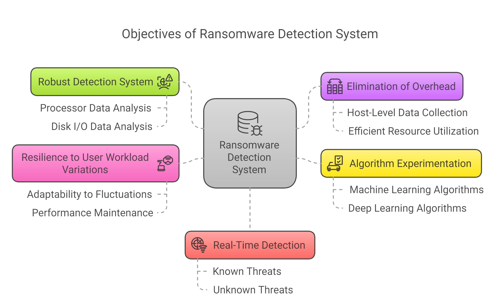
Ransomware is a high‑impact security threat capable of encrypting user data, tampering with system resources, and disrupting operations. Traditional signature‑based approaches fail against modern and zero‑day ransomware variants. This work adopts a behaviour‑based approach using processor activity and disk I/O telemetry to identify malicious patterns in near real time.

The system integrates:

* Telemetry‑driven feature extraction
* Automated preprocessing
* Multiple ML and DL classifiers
* A desktop GUI for streamlined use
* Model evaluation and comparison capabilities

---

## Proposed System

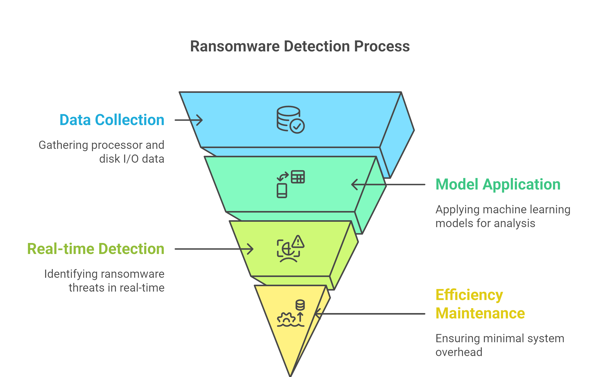

## Key Features

* Behaviour‑based ransomware classification using host telemetry
* Support for eight ML/DL models: SVM, KNN, Decision Tree, Random Forest, XGBoost, DNN, LSTM, and CNN2D
* End‑to‑end GUI for dataset handling, preprocessing, training, and prediction
* Comprehensive model evaluation metrics
* Comparison of model performance across accuracy and prediction quality
* Clear visualization of training outputs and predictions

---

## System Architecture


The architecture consists of data collection from a VM environment, preprocessing, model training across multiple classifiers, and prediction through an integrated user interface.

---

## Tech Stack

**Programming Language:** Python 3.8+
**Frameworks and Libraries:** NumPy, Pandas, Scikit‑learn, XGBoost, TensorFlow/Keras
**Interface:** Tkinter
**Visualization Tools:** Matplotlib, Seaborn

---

## Installation

### Step 1: Clone the Repository

```bash
git clone <your-repository-url>
cd ransomware-detection
```

### Step 2: Create and Activate a Virtual Environment

```bash
python -m venv venv
venv\Scripts\activate   # For Windows
```

### Step 3: Install Dependencies

```bash
pip install -r requirements.txt
```

---

## Running the Application

### Execute the Application via Python

```bash
python Main.py
```

### Execute Using Batch File

```bash
run.bat
```

---

# Project Workflow

## Dataset Upload

The system provides an interface to select and upload a dataset containing telemetry values.

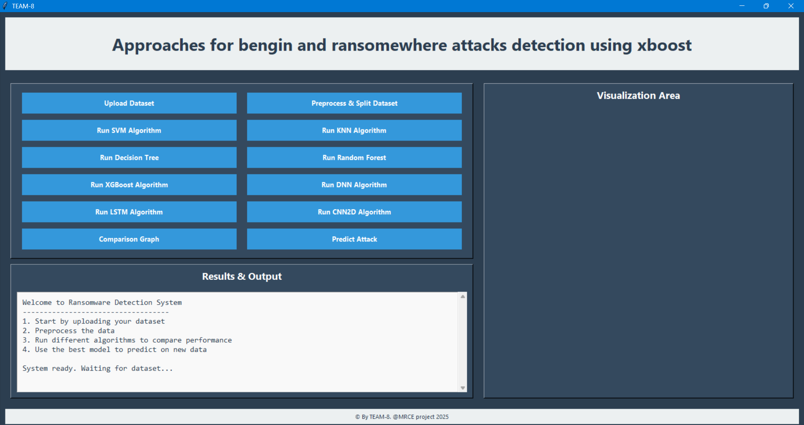
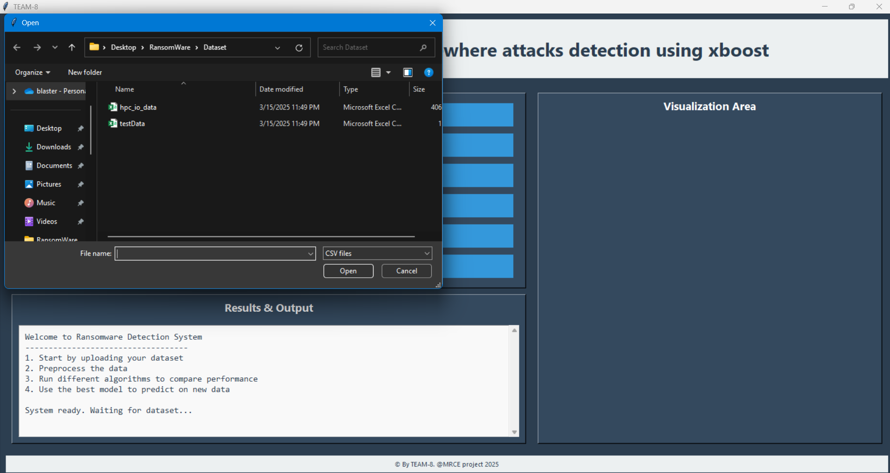
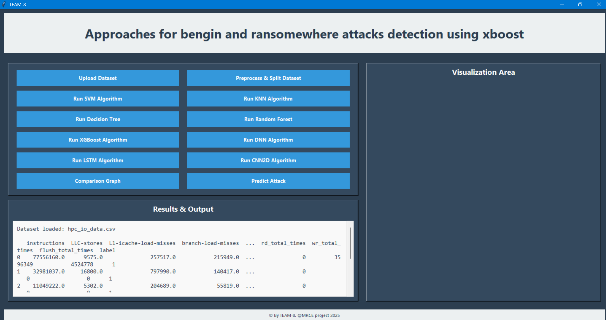
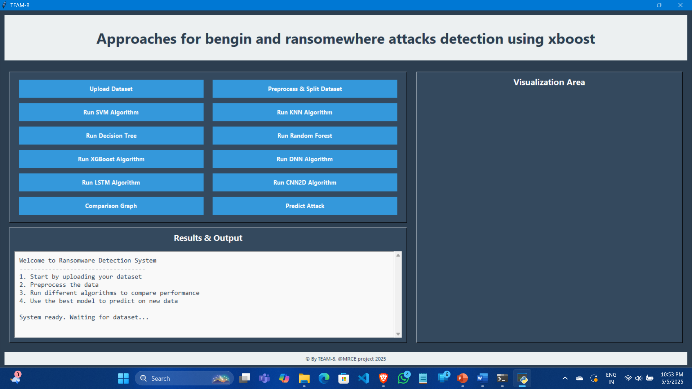

---

## Preprocessing

All uploaded data undergoes cleaning, normalization, and train‑test splitting.


---

## Command Execution

The project allows execution from both GUI and command‑line workflows.

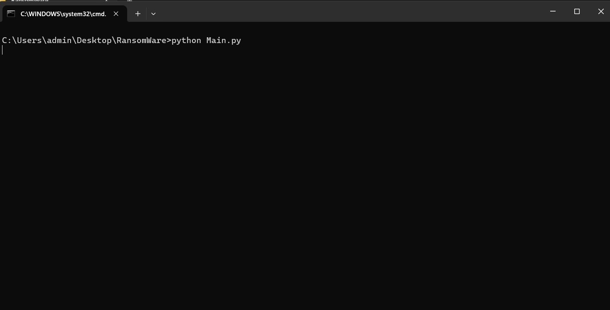
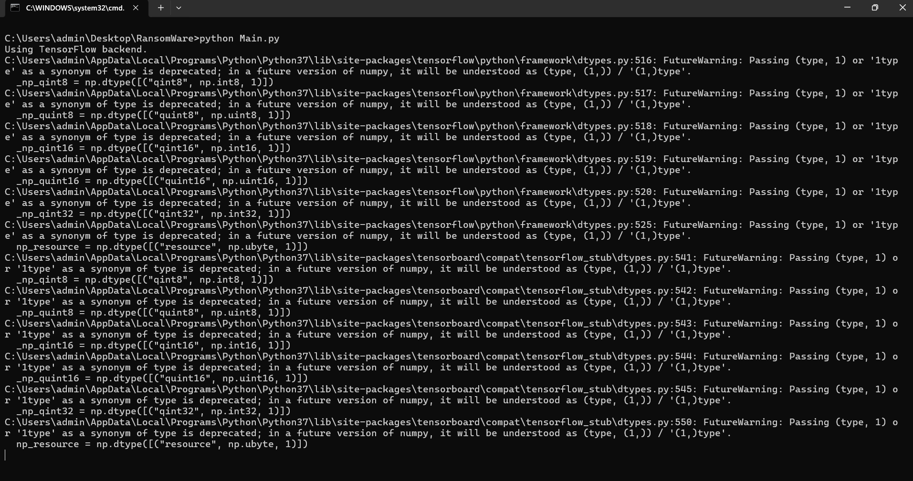

---

# Model Training and Execution

The following models are supported and executed independently through the interface.

### SVM

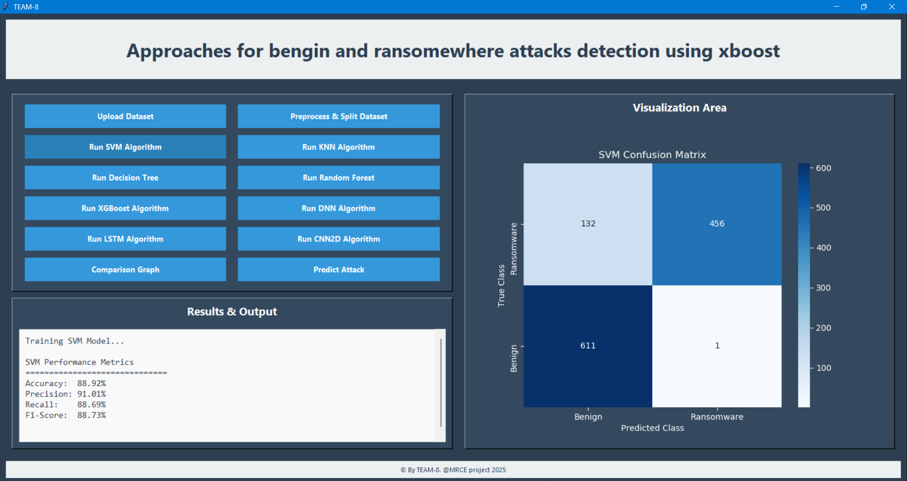

### KNN

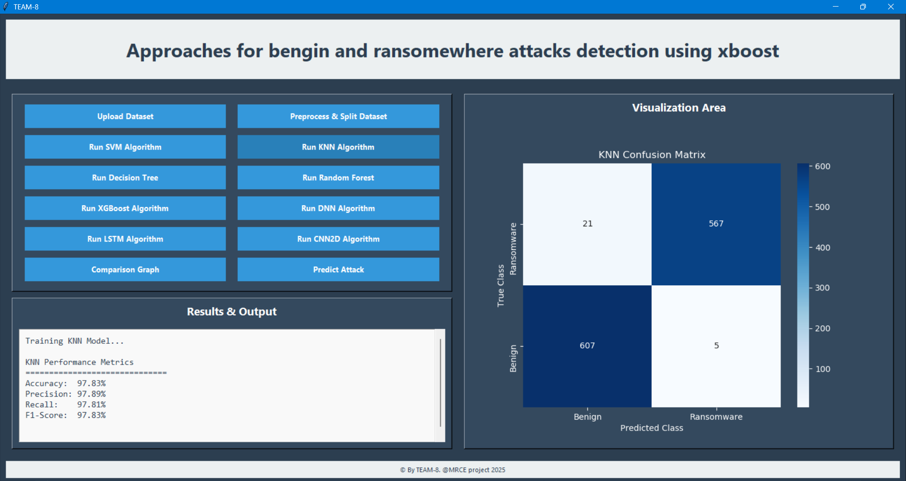

### Decision Tree

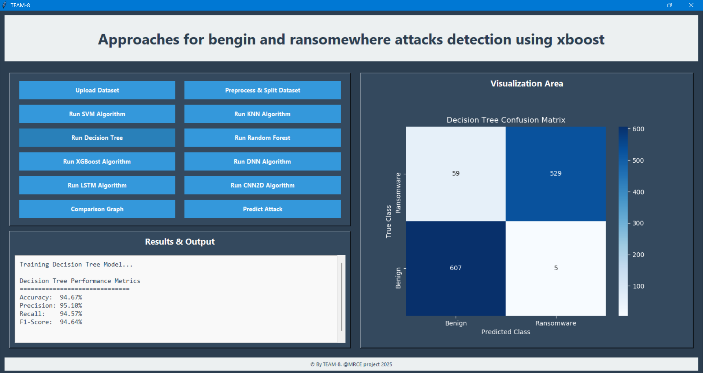

### Random Forest


### XGBoost


### DNN

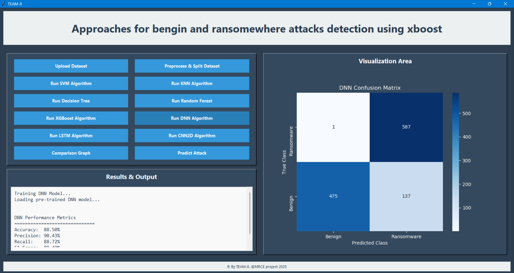

### LSTM

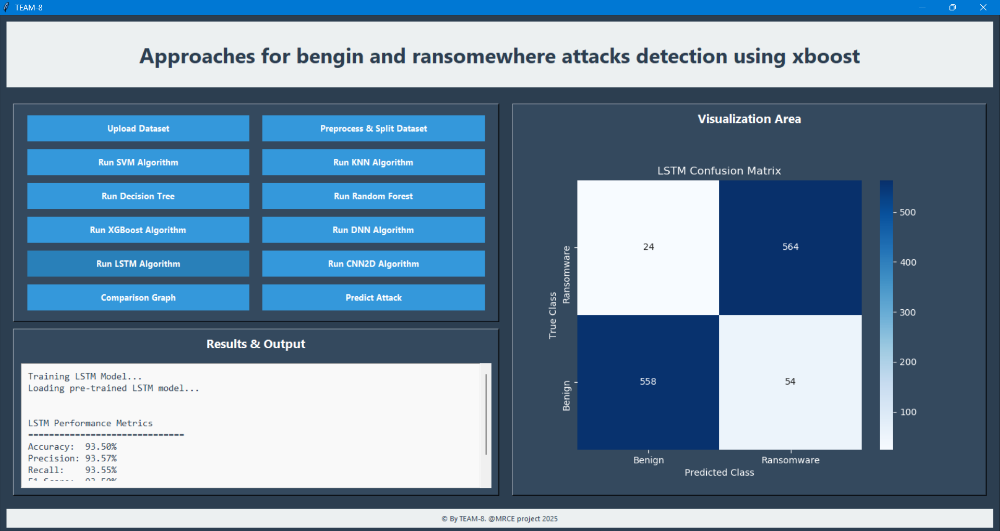

### CNN2D


---

# Comparison and Results

### Model Performance Comparison


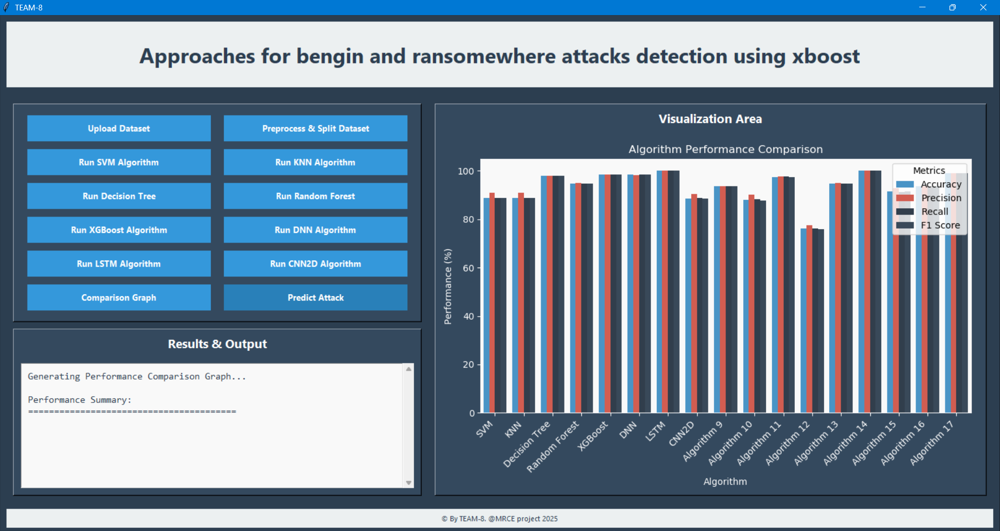

### Visualization Area


### Test File Selection

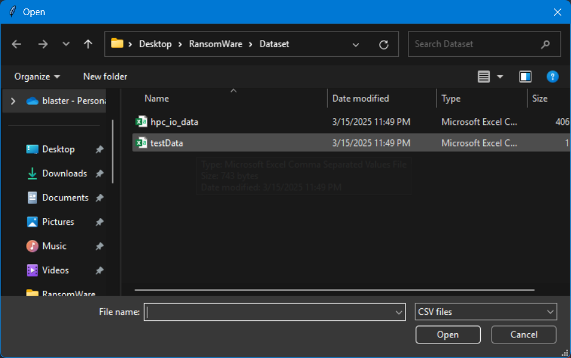

### Attack Prediction Output

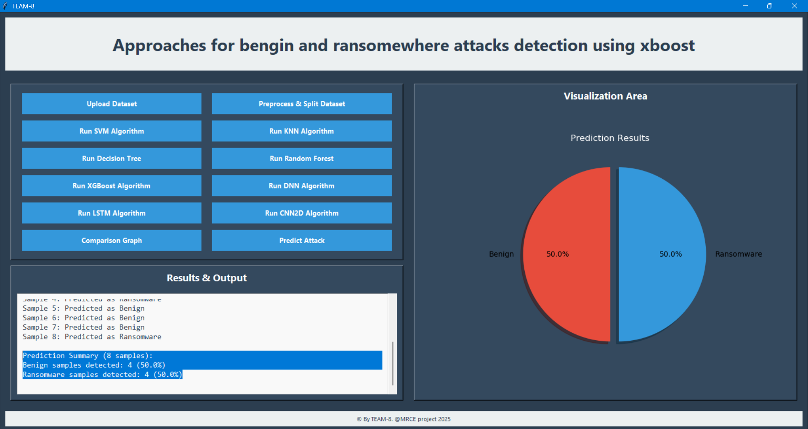

---

# Supported Models

| Model         | Type | Description                                  |
| ------------- | ---- | -------------------------------------------- |
| SVM           | ML   | Baseline statistical classifier              |
| KNN           | ML   | Distance‑based instance classifier           |
| Decision Tree | ML   | Rule‑based hierarchical classifier           |
| Random Forest | ML   | Ensemble of optimized decision trees         |
| XGBoost       | ML   | Gradient‑boosted decision tree model         |
| DNN           | DL   | Multi‑layer artificial neural network        |
| LSTM          | DL   | Sequential model for time‑dependent patterns |
| CNN2D         | DL   | Convolution‑based feature extractor          |

---

# Evaluation Metrics

* Accuracy
* Precision
* Recall
* F1‑Score
* Confusion Matrix
* Model‑to‑model comparison chart

Tree‑based models such as Random Forest and XGBoost demonstrate superior overall performance.

---

# Future Enhancements

* Real‑time monitoring agent for live telemetry
* Cloud dashboard for centralized detection and analytics
* Automated system isolation during detected threats
* Model expansion for zero‑day ransomware behaviour

---

# Team Members

* Akula Ganesh – 22Q91A6667
* Chinna Chenna Reddy Gari Sai Mokshitha – 22Q91A6678
* Palle Ramyasri – 22Q91A66B0
* Purushottam Rajpurohith – 22Q91A66B5

**Guide:** Mrs. Anju Gopi, Assistant Professor (CSE‑AIML)

---

# License

This project is intended for academic and research use. Redistribution is permitted with proper citation.
